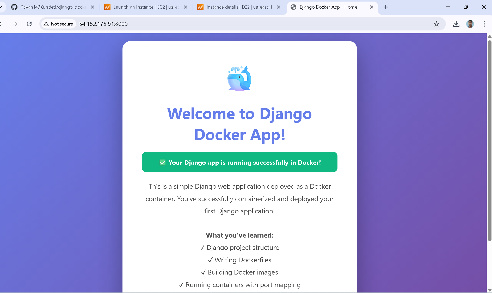
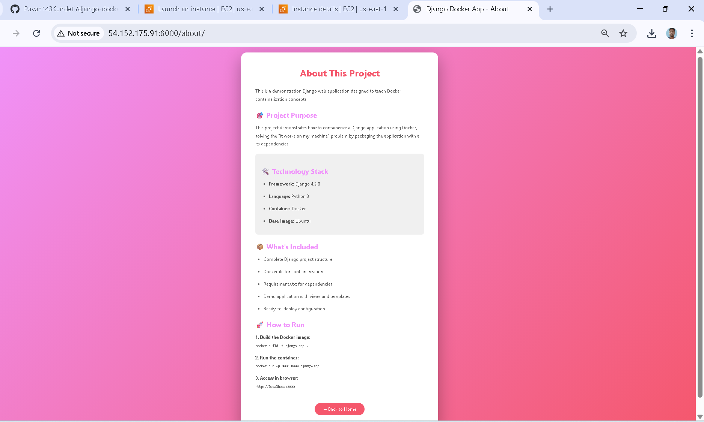
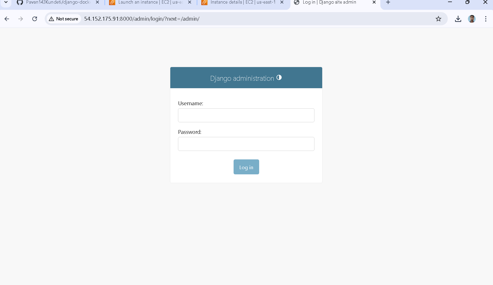

# Django Docker Deployment Project

A simple Django web application containerized with Docker for easy deployment.

## 📸 Project Screenshots

### Home Page


### About Page


### Running on AWS EC2


## 📁 Project Structure

```
.
├── Dockerfile                      # Docker configuration
├── requirements.txt                # Python dependencies
├── README.md                       # This file
└── devops/                        # Django project root
    ├── manage.py                  # Django management script
    ├── devops/                    # Project configuration
    │   ├── __init__.py
    │   ├── settings.py            # Django settings
    │   ├── urls.py                # URL routing
    │   ├── asgi.py
    │   └── wsgi.py
    └── demo/                      # Demo application
        ├── __init__.py
        ├── admin.py
        ├── apps.py
        ├── models.py
        ├── tests.py
        ├── views.py               # View functions
        ├── urls.py                # App URL routing
        └── templates/             # HTML templates
            ├── index.html
            └── about.html
```

## 🚀 Quick Start

### Prerequisites
- Docker installed on your system
- Git (to clone the repository)

### Step 1: Build the Docker Image
```bash
docker build -t django-app .
```

### Step 2: Run the Container
```bash
docker run -p 8000:8000 django-app
```

### Step 3: Access the Application
Open your browser and visit:
```
http://localhost:8000
```

## 🔧 Docker Commands

### Build Image
```bash
docker build -t django-app .
```

### Run Container
```bash
docker run -p 8000:8000 django-app
```

### Run Container in Background
```bash
docker run -d -p 8000:8000 django-app
```

### List Running Containers
```bash
docker ps
```

### Stop Container
```bash
docker stop <container-id>
```

### View Logs
```bash
docker logs <container-id>
```

### Remove Container
```bash
docker rm <container-id>
```

### Remove Image
```bash
docker rmi django-app
```

## 🌐 Using Different Ports

If port 8000 is already in use, you can map to a different port:

```bash
# Run on port 8001
docker run -p 8001:8000 django-app
```

Then access at: `http://localhost:8001`

## ☁️ AWS EC2 Deployment

### Security Group Configuration
1. Go to EC2 Console
2. Select your instance
3. Click "Security" tab
4. Edit inbound rules
5. Add rule:
   - Type: Custom TCP
   - Port: 8000
   - Source: 0.0.0.0/0

### Access Your App
```
http://<your-ec2-public-ip>:8000
```

## 📝 Key Files Explained

### Dockerfile
Contains instructions to build the Docker image:
- Base image: Ubuntu
- Installs Python 3
- Copies application code
- Installs dependencies
- Runs Django development server

### requirements.txt
Lists Python packages needed:
- Django 4.2.0
- tzdata 2023.3

### devops/settings.py
Django configuration:
- Database settings
- Allowed hosts
- Installed apps
- Middleware

### devops/urls.py
Main URL routing configuration

### demo/views.py
Contains view functions that handle requests

### demo/templates/
HTML templates for the web pages

## 🎯 What You'll Learn

- Django project structure
- Writing Dockerfiles
- Building Docker images
- Running containers
- Port mapping
- Container management

## 🔍 Troubleshooting

### Application Not Accessible
- Check port mapping: `-p 8000:8000`
- Check security group rules (AWS)
- Verify container is running: `docker ps`

### Port Already in Use
- Use different port: `-p 8001:8000`
- Stop other services using port 8000

### Container Stops Immediately
- Check logs: `docker logs <container-id>`
- Verify Dockerfile syntax

## 📚 Additional Resources

- [Django Documentation](https://docs.djangoproject.com/)
- [Docker Documentation](https://docs.docker.com/)
- [Docker Hub](https://hub.docker.com/)

## 🎓 Learning Path

1. Understand Django basics
2. Learn Docker fundamentals
3. Write Dockerfile
4. Build and test locally
5. Deploy to cloud (AWS EC2)

## 💡 Tips

- Always test locally before deploying
- Use `.dockerignore` to exclude unnecessary files
- Keep images small by using minimal base images
- Use environment variables for sensitive data
- Never commit secrets to version control

## 🤝 Contributing

Feel free to fork this project and experiment with:
- Adding more pages
- Connecting to a database
- Adding CSS frameworks
- Implementing user authentication

## 📄 License

This is a learning project - feel free to use and modify as needed!

---

Happy Learning! 🚀
